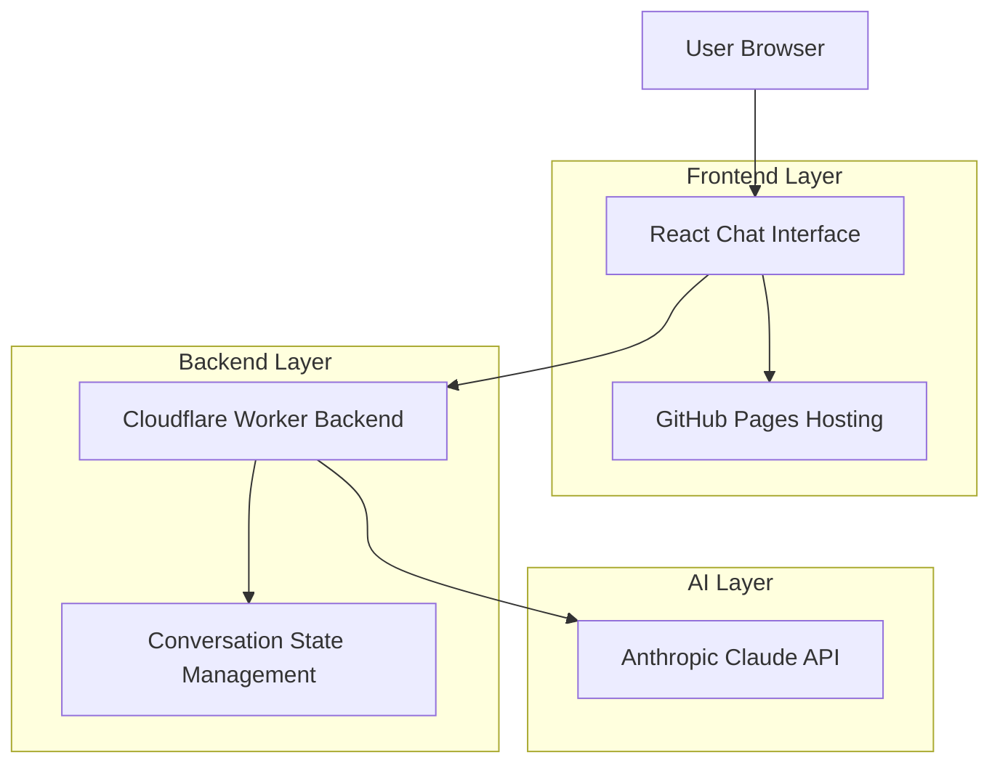

# Design Document

## Overview

The Conversational AI Scoper System is a web-based application that transforms business challenges into actionable project recommendations through a sophisticated 3-layer analysis methodology. The system consists of a React-based chat frontend and a Cloudflare Worker backend that integrates with Anthropic's Claude API to provide intelligent business consultation.

The core innovation lies in the systematic progression through three analysis layers (Goals → Signals → SMART Metrics) combined with a 3x3 business matrix framework that ensures comprehensive coverage of business relationships and domains.

## Architecture

### High-Level Architecture



### System Flow

1. **Input Processing**: User submits business challenge through chat interface
2. **Context Analysis**: Backend processes input with conversation history and system prompt
3. **AI Processing**: Claude API generates response following 3-layer methodology
4. **Response Formatting**: Backend structures AI response for frontend consumption
5. **UI Update**: Frontend displays response and maintains conversation state

### Deployment Architecture

- **Frontend**: Static React application built with Vite, deployed to GitHub Pages
- **Backend**: Cloudflare Worker deployed using Wrangler CLI with global edge distribution
- **API Integration**: Anthropic Claude API accessed from Cloudflare Worker runtime
- **Domain**: Custom domain support with HTTPS termination via Cloudflare
- **CDN**: Automatic content delivery through Cloudflare's global network
- **Environment**: API keys stored as Cloudflare Worker secrets (not in code)
- **CORS**: Configured in Worker to allow frontend access from GitHub Pages domain

## Components and Interfaces

### Frontend Components

#### ChatInterface Component
```javascript
// Primary chat container managing conversation state
const ChatInterface = () => {
  const [messages, setMessages] = useState([]);
  const [isLoading, setIsLoading] = useState(false);
  const [inputValue, setInputValue] = useState('');
  
  // Handles message submission and API communication
  // Manages loading states and error handling
  // Maintains conversation history
};
```

#### MessageList Component
```javascript
// Renders conversation history with proper styling
const MessageList = ({ messages }) => {
  // Maps through messages array
  // Applies different styling for user vs AI messages
  // Handles message formatting and timestamps
};
```

#### MessageInput Component
```javascript
// Input field with send functionality
const MessageInput = ({ onSend, isLoading }) => {
  // Controlled input with validation
  // Send button with loading state
  // Enter key submission support
};
```

#### LoadingIndicator Component
```javascript
// Animated loading feedback during AI processing
const LoadingIndicator = () => {
  // Animated dots or spinner
  // Consistent with overall design theme
};
```

### Backend Components

#### Main Worker Handler
```javascript
// Primary request handler for Cloudflare Worker
export default {
  async fetch(request, env) {
    // CORS handling for GitHub Pages domain
    // Request validation and method checking
    // Environment variable access (ANTHROPIC_API_KEY)
    // Route to conversation processor
    // Error handling and response formatting
  }
};
```

#### Cloudflare Worker Configuration
```toml
# wrangler.toml
name = "scoper-backend"
main = "src/index.js"
compatibility_date = "2024-01-01"

[env.production]
vars = { ENVIRONMENT = "production" }
# ANTHROPIC_API_KEY stored as secret via: wrangler secret put ANTHROPIC_API_KEY
```

#### Conversation Processor
```javascript
// Manages conversation context and AI interaction
class ConversationProcessor {
  constructor(apiKey) {
    this.anthropic = new Anthropic({ apiKey });
  }
  
  async processMessage(message, history) {
    // Builds conversation context
    // Calls Claude API with system prompt
    // Processes and formats response
  }
}
```

#### System Prompt Manager
```javascript
// Manages the sophisticated Scoper methodology prompt embedded in Worker
class SystemPromptManager {
  static getPrompt() {
    // Returns the complete Scoper system prompt from pseudo_scoper-system_prompt.md
    // Embedded directly in Worker code for performance
    // Includes 3-layer methodology (Goals → Signals → SMART Metrics)
    // Business matrix framework (3x3 relationships × domains)
    // Project card templates (SOP-first, Role-first, Tech-first, Quick-win)
    // Conversation flow templates and quality control requirements
  }
}
```

#### System Prompt Integration
The complete Scoper methodology from `pseudo_scoper-system_prompt.md` will be:
- **Embedded in Worker Code**: Full prompt included as string constant in `src/index.js`
- **Sent to Claude API**: Used as system message for every conversation
- **Version Controlled**: Prompt updates deployed with Worker code changes
- **Performance Optimized**: No external file reads, immediate availability

### API Interfaces

#### Frontend to Backend
```typescript
interface ChatRequest {
  message: string;
  history: ChatMessage[];
}

interface ChatMessage {
  role: 'user' | 'assistant';
  content: string;
  timestamp: string;
}

interface ChatResponse {
  response: string;
  success: boolean;
  error?: string;
}
```

#### Backend to Claude API
```typescript
interface ClaudeRequest {
  model: 'claude-sonnet-4-20250514';
  max_tokens: number;
  messages: ClaudeMessage[];
  system: string; // Complete Scoper system prompt embedded in Worker
}

interface ClaudeMessage {
  role: 'user' | 'assistant';
  content: string;
}

// System prompt structure in Worker
const SCOPER_SYSTEM_PROMPT = `
# Scoper Main Prompt
You are Scoper, a precise AI assistant that consistently translates founder/owner intent...
[Complete content from pseudo_scoper-system_prompt.md embedded here]
`;
```

## Data Models

### Conversation State
```typescript
interface ConversationState {
  sessionId: string;
  messages: ChatMessage[];
  currentLayer: 1 | 2 | 3;
  businessMatrix: {
    relationship: 'owner-company' | 'owner-employee' | 'employee-company';
    domain: 'actors' | 'information' | 'processes';
  };
  goalType: 'problem-solving' | 'idea-execution';
  analysisComplete: boolean;
}
```

### Business Analysis Context
```typescript
interface BusinessContext {
  coreStatement: string;
  urgencyLevel: 'urgent' | 'difficult' | 'discovery' | 'prototype';
  teamSize: number;
  constraints: {
    time: string;
    budget: string;
    resources: string[];
  };
  assumptions: string[];
}
```

### Project Card Structure
```typescript
interface ProjectCard {
  title: string;
  goalStatement: string;
  whyNow: string;
  approach: 'sop-first' | 'role-first' | 'tech-first' | 'quick-win';
  teamwork: {
    founderRole: string;
    teamMemberRole?: string;
    externalSupport: string[];
  };
  successMetrics: {
    primary: string;
    secondary: string[];
    timeline: string;
  };
  unlocks: string;
  assumptions: string[];
  estimatedEffort: string;
}
```

## Error Handling

### Frontend Error Handling
- **Network Errors**: Display user-friendly messages with retry options
- **API Timeouts**: Show loading state with timeout handling
- **Invalid Responses**: Graceful degradation with error messages
- **Browser Compatibility**: Feature detection and fallbacks

### Backend Error Handling
- **Claude API Errors**: Rate limiting, quota exceeded, service unavailable
- **Authentication Failures**: API key validation and error responses
- **Request Validation**: Input sanitization and validation errors
- **CORS Issues**: Proper header configuration and error responses

### Error Response Format
```typescript
interface ErrorResponse {
  success: false;
  error: {
    code: string;
    message: string;
    details?: any;
  };
}
```

## Testing Strategy

### Frontend Testing
- **Unit Tests**: Component behavior and state management
- **Integration Tests**: API communication and error handling
- **E2E Tests**: Complete conversation flows and user interactions
- **Accessibility Tests**: Screen reader compatibility and keyboard navigation

### Backend Testing
- **Unit Tests**: Individual function behavior and edge cases
- **Integration Tests**: Claude API integration and response processing
- **Load Tests**: Performance under concurrent requests
- **Security Tests**: Input validation and API key protection

### Conversation Flow Testing
- **Layer Progression**: Verify sequential 3-layer analysis
- **Business Matrix Mapping**: Correct classification of business situations
- **Project Card Generation**: Quality and relevance of recommendations
- **Edge Cases**: Vague inputs, multiple problems, unrealistic expectations

### Test Data
- Use conversation examples from `pseudo_scoper-mocks.md`
- Create additional test scenarios for edge cases
- Mock Claude API responses for consistent testing
- Validate against real business consultation scenarios

## Performance Considerations

### Frontend Optimization
- **Code Splitting**: Lazy load components for faster initial load
- **Bundle Size**: Minimize dependencies and optimize build output
- **Caching**: Implement service worker for offline capability
- **Responsive Design**: Optimize for mobile and desktop performance

### Backend Optimization
- **Cold Start**: Minimize Worker initialization time
- **Response Caching**: Cache common responses where appropriate
- **Request Batching**: Optimize Claude API usage
- **Global Distribution**: Leverage Cloudflare edge network

### Scalability Planning
- **Rate Limiting**: Implement user-based rate limiting
- **Cost Management**: Monitor Claude API usage and costs
- **Performance Monitoring**: Track response times and error rates
- **Capacity Planning**: Plan for user growth and usage patterns

## Security Considerations

### API Security
- **Environment Variables**: Secure storage of Anthropic API key
- **CORS Configuration**: Restrict access to authorized domains
- **Input Validation**: Sanitize and validate all user inputs
- **Rate Limiting**: Prevent abuse and excessive usage

### Data Privacy
- **No Persistent Storage**: Conversations not stored server-side
- **Client-Side State**: Conversation history managed in browser
- **Data Transmission**: HTTPS encryption for all communications
- **PII Handling**: Guidelines for handling sensitive business information

### Deployment Security
- **GitHub Pages**: Secure static site deployment
- **Cloudflare Workers**: Secure serverless execution environment
- **Domain Security**: HTTPS enforcement and security headers
- **Access Control**: Environment-based configuration management